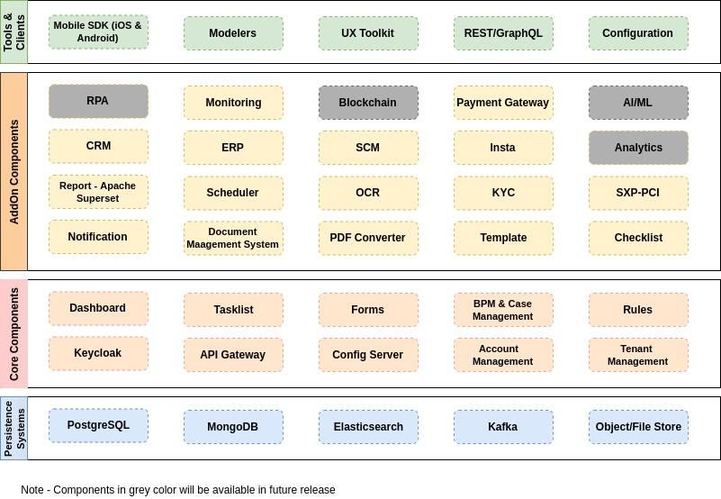
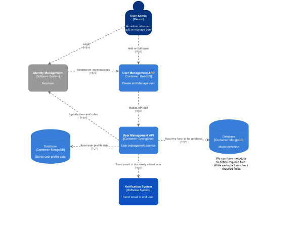
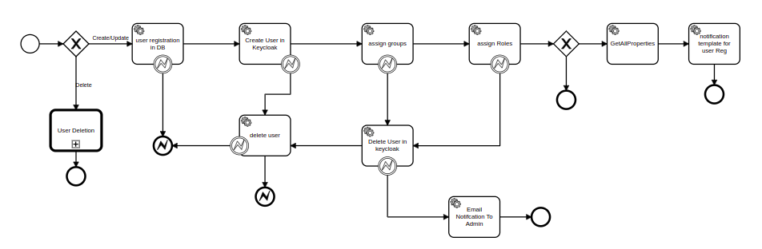
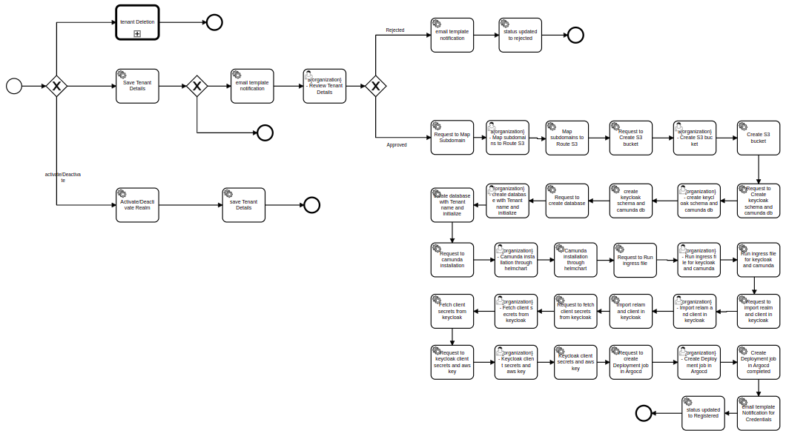
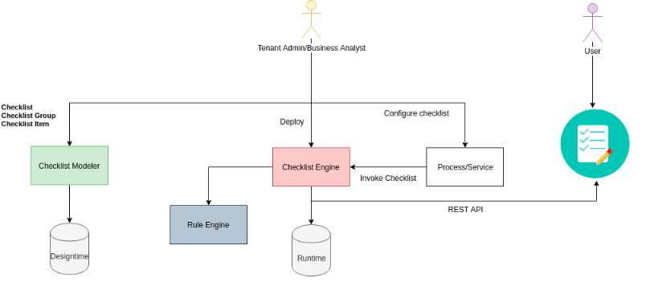
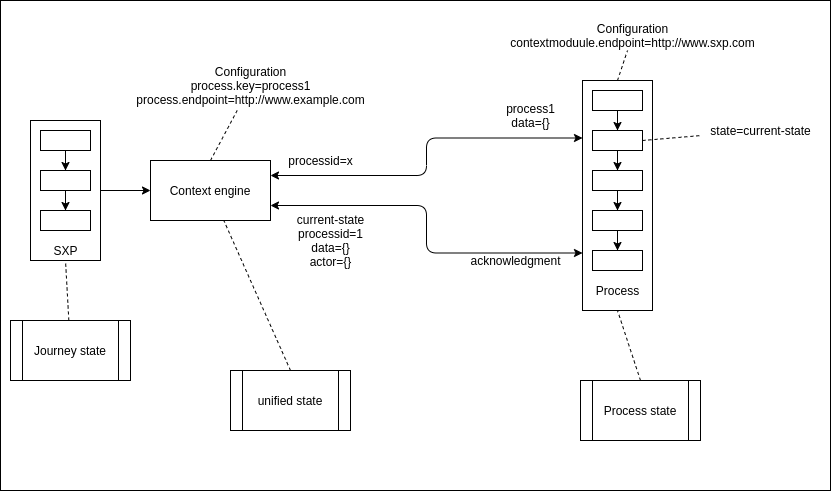
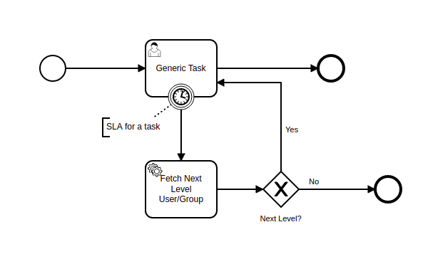
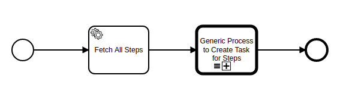
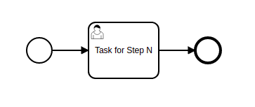
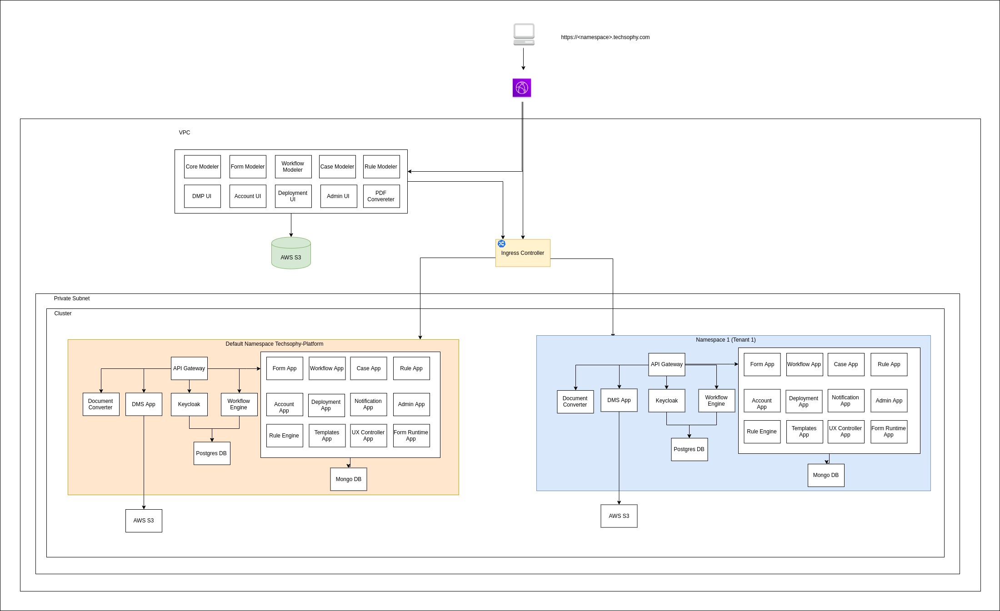

# AWGMENT

[Introduction 4](#introduction)

[Quick Start 4](#quick-start)

[AWGMENT Community and Support 4](#awgment-community-and-support)

[Project Repository Structure 4](#project-repository-structure)

[AWGMENT Components 5](#awgment-components)

<!-- 
[Tenant Management 10](#_Toc113601703)

[Multitenancy 11](#_Toc113601704)

[Notification Service 11](#_Toc113601705)

[Document Management System 11](#_Toc113601706)

[Template Modeler 12](#_Toc113601707)

[Template Service 12](#_Toc113601708)

[Template Runtime Service 12](#_Toc113601709)

[Document Converter 12](#_Toc113601710)

[PDF Converter 13](#_Toc113601711)

[Scheduler Service 13](#_Toc113601712)

[Report Service 13](#_Toc113601713)

[Checklist 13](#_Toc113601714)

[Checklist Modeler 14](#_Toc113601715)

[Checklist Dashboard 15](#_Toc113601716)

[Checklist Service 15](#_Toc113601717)

[Checklist Engine 15](#_Toc113601718)

[Elastic Search Service 15](#_Toc113601719)

[Case Modeler 15](#_Toc113601720)

[Case Service 16](#_Toc113601721)

[Process Context Integration 16](#_Toc113601722)

[Escalation Matrix 16](#_Toc113601723)

[Escalation Matrix Modeler 16](#_Toc113601724)

[Escalation Matrix Service 16](#_Toc113601725)

[Escalation Matrix Runtime Service 17](#_Toc113601726)

[Dynamic Steps 17](#_Toc113601727)

[Payment Gateway 18](#_Toc113601728) -->

[AWGMENT Deployment Diagram (with multitenancy) 19](#awgment-deployment-diagram-with-multitenancy)

# Introduction

Awgment Platform is a comprehensive cloud native platform for rapid development, deployment, monitor and change management of enterprise application. Awgment focuses on the "plumbing" of enterprise applications so that teams can focus on application-level business logic, without unnecessary ties to specific deployment environments. By using Awgment to integrate models and data into native services, developers can create powerful products or services leveraging cloud-native technologies.

An overview of individual components can be found [here](docs/overview.md)

# Quick Start

The easiest way to start using AWGMENT is to install the AWGMENT platform.

**To get started:**

git clone https://github.com/TechsophyOfficial/awgment-package.git

cd awgment-package

Follow the instructions as per

https://github.com/TechsophyOfficial/awgment-package/blob/main/README.md

# AWGMENT Community and Support

Report bugs, ask questions and request features [here on GitHub](https://github.com/TechsophyOfficial/Awgment/issues) and tag @TechsophyOfficial/awgment-owners.

All contributions are welcome, please follow guidelines as per [CONTRIBUTING](CONTRIBUTING.md)

# Project Repository Structure

The AWGMENT Platform is built from a number of components.
The core components are open-sourced while others are on the roadmap.

The open-sourced component repos can be found [here](https://github.com/orgs/TechsophyOfficial/repositories)

# AWGMENT Components

An overview of individual components can be found [here](docs/overview.md)

<!-- ## Core Components

### Cloud Config Server

Cloud Config Server enables a centralized server to provide configuration properties for all the services and central source for managing configuration across deployment environments in awgment platform.

### API Gateway

API Gateway offers reverse proxy to redirect or route requests to the endpoints of all services in awgment platform. It provides a single endpoint or url for the client apps and then internally maps the requests to internal services. Provides a centralized authentication mechanism for all the services in the platform by integrating with the keycloak.

### Keycloak

[keycloak](https://www.keycloak.org/) is an open-source identity provider and provides the following features for the applications in the awgment platform.

- Centralized authentication in the platform
- Supports OIDC
- Supports RBAC
- Support 2FAS, Social and OTP authentication
- Customize login page, authentication flow etc
- Provides Forgot/Change Password

### Manage Accounts

Manage Accounts provides user interfaces to manage users, roles and groups required for an application. The following are the features from Manage Accounts.

- Create/Update/Delete users
- Create/Update/Delete groups
- Assign groups and roles to users
- Enables to customize the create/edit user form

 
#### Account Service

Account Service exposes rest interfaces to manage users, roles and groups. Provides rest api to upload bulk users required for an application using csv file.

For more details refer to GitHub repo [awgment-app-account](https://github.com/TechsophyOfficial/awgment-app-account)

**High level component diagram**

For more details refer to GitHub link.

 
**User Registration Workflow**

### Form Modeler

Form Modeler component provides the following features.

- Drag and drop interface to build the forms required for applications
- Supported **components** in form modeler - _text field, text area, button, number, password, phone number, url, email, check box, currency, select, select boxes, date/time, radio, day, time, address, panel, table, tabs, file_
- Enables to create/update/delete/preview/deploy/import/export a form
- Enables to configure the react/angular components or html pages to render in an application or task. Out of the box provides workflow task type components (Question, Confirmation, Checklist, Document and Validation) to choose them for a user task by providing the necessary properties to render these for a generated task.
- Supports versioning of forms.
- Built using [react-formio](https://github.com/formio/react-formio) library

For more details refer to GitHub repo [awgment-modeler-form](https://github.com/TechsophyOfficial/awgment-modeler-form)

### Form Service

Form Service exposes REST interfaces to create/update/delete/deploy/import/export forms and components (web components e.g., react/angular/html).

For more details refer to GitHub repo [awgment-app-form](https://github.com/TechsophyOfficial/awgment-app-form).

### Form Runtime Service

Form runtime service exposes REST interfaces to manage the runtime forms. Upon deploying the form from form modeler, the form is persisted in the form runtime database. This runtime form should be used in the application, so that there is design time and runtime segregation of form.

Form Data APIs – Form Runtime Service exposes generic REST interface to perform CRUD operations using form. Use form id (which is auto generated when a form is created) to perform CRUD and Search operations for the data persisted using the form.

For more details refer to GitHub repo [awgment-app-runtime-form](https://github.com/TechsophyOfficial/awgment-app-runtime-form).

### Workflow Modeler

Workflow Modeler is a micro frontend provides the following features.

- Drag and drop interface to build the workflows based on [BPMN](https://www.omg.org/spec/BPMN/2.0/About-BPMN/) standard
- Enables to create/update/delete/view BPMN/deploy/import/export a workflow.
- Enables to select a form or a component (react/angular/html) for a user task in a workflow
- Enables to look up and choose a REST API, mapping of process variables with the request/response for a service task in a workflow
- Supports versioning of workflow
- Built using the [bpm-js](https://github.com/bpmn-io/bpmn-js) and [camunda-bpmn-moddle](https://github.com/camunda/camunda-bpmn-moddle) plugin

For more details refer to GitHub repo [awgment-modeler-workflow](https://github.com/TechsophyOfficial/awgment-modeler-workflow).

### Workflow Service

Workflow service exposes REST interfaces to create/update/delete/deploy/import/export workflows.

For more details refer to GitHub repo [awgment-app-workflow](https://github.com/TechsophyOfficial/awgment-app-workflow).

### Workflow Engine

Workflow Engine enables to execute the workflows using[Camunda](https://camunda.com/) an open-source workflow engine.

The following are the features.

- Executes the workflow/process definitions
- Provides user interface to monitor and manage the process instances
- Provides user interface to manage authorizations at process or resource level
- Provides reusable workflows for user registration, tenant registration, send email with an attachment.
- This is an embedded camunda engine spring boot app integrated with keycloak.
- Built custom REST Connector to configure and invoke the rest api using service task.

For more details refer to GitHub repo [awgment-modeler-workflow](https://github.com/TechsophyOfficial/awgment-modeler-workflow).

### Tasklist (Case-Inbox)

Tasklist component enables users to manage their tasks in awgment platform.

The following are the features.

- View assigned/involved/group/all tasks
- Claim/Complete a task
- View enabled/active/complete activities for a task which is generated from case model
- View/Add comments of a task
- Add Filter - To create a separate menu in tasklist to view the tasks based on filter criteria

For more details refer to GitHub repo [awgment-ui-case](https://github.com/TechsophyOfficial/awgment-ui-case).

### UX-Controller

UX-Controller is a wrapper service exposes REST interfaces to call workflow engine APIs. This wrapper service helps in replacing camunda workflow engine or integrating with other bpm tools (e.g., alfresco, flowable etc) in without impacting the applications or clients.

Note: All the communication with workflow engine from any client or user interface should be through this service (using rest interfaces).

For more details refer to GitHub repo [awgment-app-ux-controller](https://github.com/TechsophyOfficial/awgment-app-ux-controller).

### Rule Modeler

Rule Modeler component provides the following features.

- Drag and drop interface to build the rules or decision tables based on [DMN](https://www.omg.org/dmn/) standard required for applications
- Enables to create/update/delete/deploy/import/export a rule
- Supports versioning of rule
- Built using the [dmn-js](https://bpmn.io/toolkit/dmn-js/) plugin

For more details refer to GitHub repo [awgment-modeler-rule](https://github.com/TechsophyOfficial/awgment-modeler-rule).

### Rule Service

Rule service exposes REST interfaces to create/update/delete/deploy/import/export rules.

For more details refer to GitHub repo [awgment-app-rule](https://github.com/TechsophyOfficial/awgment-app-rule).

### Rule Engine

Rule Engine component provides the following features.

- Executes the rules or decision tables
- Rest interface to execute rules or decision tables
- Uses [camunda decision engine](https://github.com/camunda/camunda-engine-dmn) for evaluating the rules or decision tables.

For more details refer to GitHub repo [awgment-rule-engine](https://github.com/TechsophyOfficial/awgment-rule-engine).

## Additional Components
The below components are on the roadmap to be open sourced, please reachout to @TechsophyOfficial/awgment-owners, if further details are required about them.

### Tenant Management

Tenant Management enables Admin (or Platform Admin) user to manage tenants in the AWGMENT platform. Tenant Management component provides the following features.

- Admin user can create/update/delete/activate/deactivate/approve/reject a tenant.
- Sends notification to registered tenant user upon successful tenant creation
- Customize tenant registration workflow and forms

For more details refer to GitHub link.

**Tenant Registration Workflow**

The following diagram represents the tenant registration workflow which gets invoked upon create/update/delete of a tenant.

1. Save the tenant details in awgment database
2. Awgment platform administrator will receive an email notification and task in his inbox with tenant details for approval
3. Awgment platform administrator will approve/reject based on the tenant details
4. On approve, tenant is registered successfully in awgment platform with the
  1. Initialize the tenant db with the required data
  2. Create separate realm in keycloak
  3. Create required clients in realm
  4. S
  5. S
  6. S
  7. s

_Multitenancy_

Awgment platform enables organizations to build their applications or solutions with multitenancy support. Each tenant gets its own logical instance of the application and database. Data is shared among the users within a tenant, but not with other tenants. Typical multitenant deployment diagram is given above.

### Notification Service

Notification Service enables to send notifications to users. Notification service provides the following features.

- Rest interface to send notifications (Email/SMS/Push) to users
- Supports template-based notifications
- Supports attachments in email notifications
- Supports SMTP/AWS SES Email gateways
- Supports AWS SNS/Twilio SMS gateways
- Supports Google Firebase push notifications
- Provides an interface to implement any gateways
- Provides GraphQL API to send notifications

For more details refer to GitHub link.

### Document Management System

Document Management System (DMS) enables to manage the documents required for an application. DMS component provides the following features.

- REST interfaces to upload/download/preview/search/history of the documents.
- Supports versioning of documents
- Supports document metadata
- Supports document types
- Supports template-based document generation using templateId and templateData
- Extension validation
- Size limit for a document
- Supports integration with AWS S3, Digital Ocean Storage Space and Azure Blob.
- REST Interface to support File component in Form Modeler

For more details refer to GitHub link.

### Template Modeler

Template Modeler component enables the users to manage the templates required for sending notifications (Email/SMS/Push) and generating documents in an application.

- Modeler to upload/download/delete template

For more details refer to GitHub link.

### Template Service

Template service provides the following features.

- Store the templates in GridFS of MongoDB
- Provides REST interface to upload/download/delete a template
- Provides REST interface to fetch templates
- Supports versioning of templates

For more details refer to GitHub link.

### Template Runtime Service

Template Runtime service provides the following features.

- Store the templates in GridFS of MongoDB
- Provides REST interface to upload/download /delete a template
- Provides REST interface to fetch templates
- Supports versioning of templates
- Note: Use runtime templates in applications so that the templates can be updated in design time and can be deployed once they are finished.

For more details refer to GitHub link.

### Document Converter

Document Converter service converts ftl template to html by replacing the placeholders in the ftl template with the required data.

- Uses [apache free marker](https://freemarker.apache.org/) template to convert the ftl to html
- Provides REST interface to convert the ftl to html document

For more details refer to GitHub link.

### PDF Converter

PDF converter service converts html file to pdf document.

- Converts html file to PDF document
- Provides REST interface to convert the html to pdf document
- Built using node library [Puppeteer](https://github.com/puppeteer/puppeteer)

For more details refer to GitHub link.

### Scheduler Service

Scheduler service enables to schedule a job at a specified date and time. It allows to perform the operations to schedule or unschedule the jobs.

The following are the features.

- REST interface to create/update/delete/start/pause/stop a schedule
- Supports cron expressions
- Supports configuration of rest endpoint in the schedule to invoke it when the job gets executed
- Built using [Quartz](http://www.quartz-scheduler.org/) library

For more details refer to GitHub link.

### Report Service

Report Service uses [apache-superset](https://superset.apache.org/docs/intro) is an open-source business intelligence (BI) tool. It is fast, lightweight, intuitive, and loaded with options to explore and visualize the data.

The following are the features.

- An intuitive interface for visualizing datasets and crafting interactive dashboards
- A wide array of beautiful visualizations to showcase your data
- Out-of-the-box support for most SQL-speaking databases

- Integrated with keycloak for seamless authentication with awgment platform
- Support to export a report in xls format

For more details refer to GitHub link.

### Checklist

Checklist is a to-do list of items that needs to be completed by a human or a system to accomplish a business goal.

Above diagram represents how to create a checklist and use it in application.

The following are the actions performed by tenant admin/business analyst.

- Creates the checklist items, checklist groups and checklist from checklist modeler
- Upon successful creation, deploys the checklist into the checklist engine from checklist modeler
- Deploy the rules configured in the checklist into the rule engine from rule modeler
- Configure the checklist for a user task in a workflow
- Upon instantiating a workflow, checklist instance is created and assigned to a user

Checklist engine evaluates the assignment and satisfy rules configured in the checklist and returns the response accordingly.

The following are the actions performed by a user

- Login to the checklist dashboard and view the checklist instances assigned to him
- Chooses a checklist instance and completes the items he is responsible for within the checklist instance

For more details refer to GitHub link.

### Checklist Modeler

Checklist Modeler enables drag and drop interface to build checklist related artifacts.

The following are the features.

- View/Create/Update/Delete checklist items, checklist groups and a checklist
- Deploy a checklist into the checklist engine
- Separate tabs to view and filter checklist items, groups and checklists

For more details refer to GitHub link.

### Checklist Dashboard

Checklist Dashboard component provides the following features.

- View checklist instances
- Complete checklist instance

For more details refer to GitHub link.

### Checklist Service

Checklist Service enables to manage the checklist related artifacts.

The following are the features.

- Rest interface to create/read/update/delete checklist item, checklist group and checklist
- Rest interface to filter/used by checklist artifacts
- Supports versioning

For more details refer to GitHub link.

### Checklist Engine

Checklist Engine enables to manage the checklist instances.

The following are the features.

- Rest interface to deploy checklist into checklist engine
- Rest interface to instantiate/complete/filter checklist
- Supports audit

For more details refer to GitHub link.

### Elastic Search Service

Elastic Search Service enables to manage the data in [elastic search](https://www.elastic.co/guide/en/elasticsearch/reference/current/index.html) for search and analytics for all types of data in the awgment platform.

- Rest interface to fetch (based on full text and filter) and push the data to elastic search indices
- All the services in awgment uses this wrapper service to retrieve the data (for faster retrieval of data). However, this is optional. In case elastic search is enabled in respective service, data will be pushed to and retrieved from elastic indices.

### Case Modeler

Case Modeler enables to build case models in awgment platform.

The following are the features.

- Supports [CMMN](https://www.omg.org/cmmn/) standard
- Built using [cmmn-js](https://github.com/bpmn-io/cmmn-js)

### Case Service

Case Service exposes rest interface to create/update/delete/deploy/import/export case models. Case models are deployed into workflow engine I.e., camunda engine for execution.

For more details refer to GitHub link.

### Process Context Integration

Process Context Integration service is an adaptor service which enables communication between SXP and bpm platforms (currently supports camunda workflow engine).

The following are the features of PCI service

- Exposes rest interfaces to Invoke SXP Journey by journey name, journey id and context
- Exposes rest interface to Start Process, Resume Process with context
- Exposes rest interface to fetch history for a transaction (SXP conversation and Process activity)
- Exposes rest interface to log message into log stream (currently supports mongo db for) from Process/service (using Service Task) or SXP

### Escalation Matrix

Escalation Matrix enables applications or business processes when escalation should happen and who should handle the work item or task at each escalation level.

### Escalation Matrix Modeler

Escalation Matrix Modeler enables to manage escalation matrices.

For more details refer to GitHub link.

### Escalation Matrix Service

Escalation Matrix Service exposes rest interface to create/read/update/delete an escalation matrix.

For more details refer to GitHub link.

### Escalation Matrix Runtime Service

Escalation Matrix runtime service exposes rest interface to manage runtime escalation matrix. Applications or business process uses these runtime escalation matrices for execution.

For more details refer to GitHub link.

Below is the reusable process to use it in applications or any other business processes for handling escalations for a task based on the configured escalation matrix. This is a generic process which requires task details and escalation matrix details so that based on the configured escalation matrix tasks are escalated to next levels based on SLA defined.

### Dynamic Steps

Dynamic Steps feature is part of escalation matrix module enables to create task dynamically based on configured steps involved in an application or business process.

Below is the reusable process to use it in applications or any other business processes for creating tasks dynamically based on configured steps (Considering each step is a task). This is a generic process which requires task details and steps details so that based on the configured dynamic steps, tasks are created.

- UI (Dynamic Steps) to create steps with step no & step name for an activity (or functionality)
- CRUD API for Dynamic Steps UI
- API to fetch the steps based on activity
- Generic workflow to create task (I.e., step) based on the activity

### Payment Gateway

Payment gateway service enables applications to initiate ecommerce, in-app, and point of sale payments for a broad variety of payment service providers (PayPal, RazorPay, Paytm). The payment gateway is typically a wrapper service provides rest interface for orders, transfers, payments etc. Persists the transaction details in mongo db for reporting and auditing purpose.

# -->

# AWGMENT Deployment Diagram (with multitenancy)

Awgment platform enables organizations to build their applications or solutions with multitenancy support. Each tenant gets its own logical instance of the application and database. Data is shared among the users within a tenant, but not with other tenants. Typical multitenant deployment diagram is provided-

